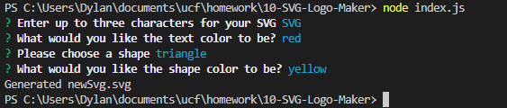
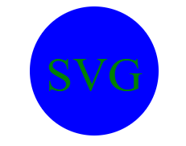

## SVG Logo Maker

## Description

This application will allow users to create simple SVG logos. The user may choose any color and choose between three shapes: circle, triangle, and square. The application will prompt users to answer a few questions in order to generate the simple SVG logo. The four prompts that this application will ask users are:

1. Enter up to three characters for your SVG
2. What would you like the text color to be?
3. Please choose a Shape
4. What would you like the shape color to be?

## Screenshots

;

## Video Demonstration

Here is a link to a video that demonstrates the functionality of the application.
https://drive.google.com/file/d/1aqsE08atnRkHP1tLNP2X58_XfH1XM-6B/view

## installation

1. Clone the repo
2. Open in VS Code
3. open the terminal and install node.js.
4. After node.js has been installed, create a package.json by typing "init -y"
5. type "npm i" in order to install the dependencies associated with the application.
6. Run the application by typing "node index.js" within the terminal.

## Test Instructions

In order to run the tests, open the terminal and type the command "npm run test".
